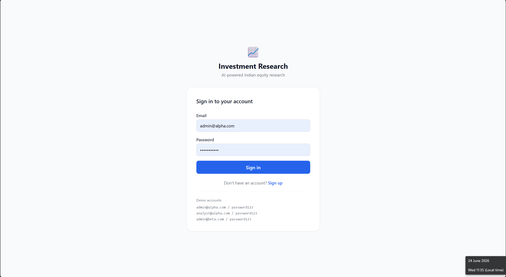
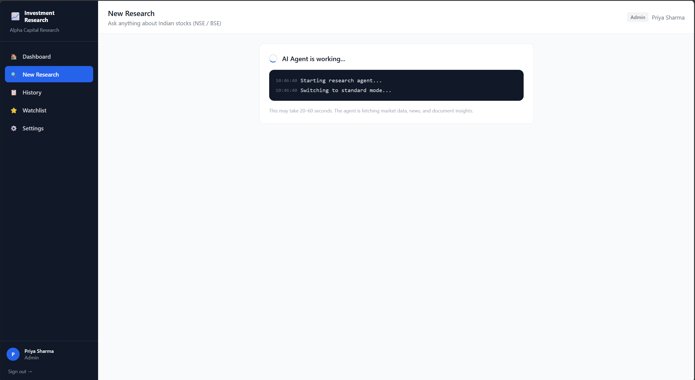
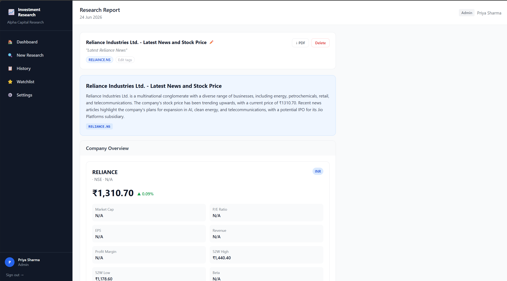
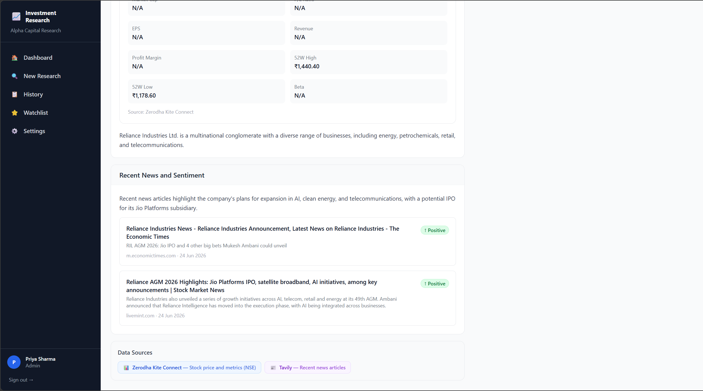
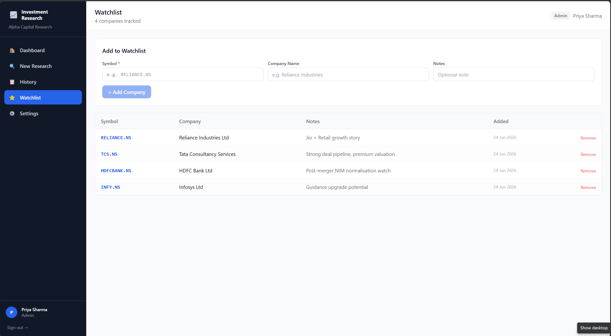
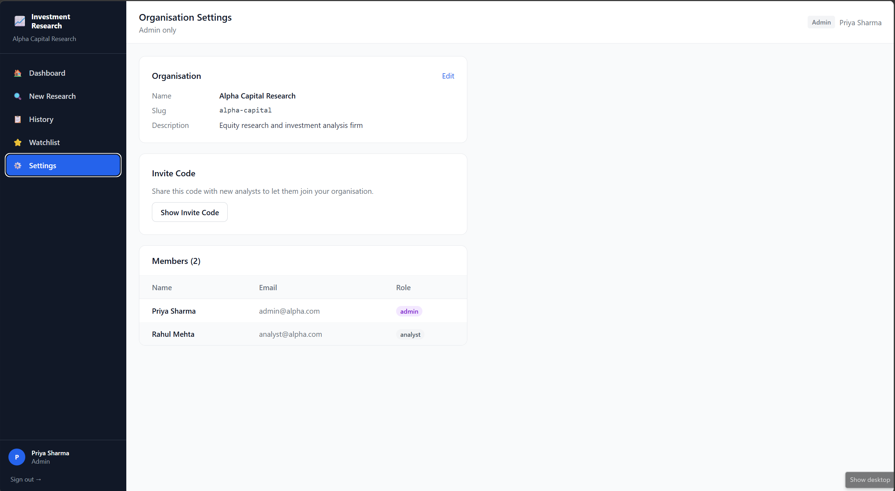

# Finalytics AI Terminal — AI-Powered Investment Research Platform

An AI-powered investment research dashboard built for Indian equity markets (NSE/BSE). Analysts type natural language queries and receive structured, source-attributed research in minutes instead of hours.

---

## What It Does

An analyst types something like:

> "Analyze Reliance Industries quarterly results. Compare revenue growth with ITC. Summarize recent news sentiment and key risks."

Finalytics AI Terminal's agent figures out what data is needed, fetches live stock prices from Kite Connect, pulls recent news via Tavily, searches through quarterly report PDFs stored in the knowledge base, and returns a structured report — with company cards, financial comparison tables, stock charts, sentiment badges, and source attribution on every data point.

No hardcoded pipeline. The agent decides which tools to call based on the query. Ask only about news → it skips stock data. Ask for a full analysis → it calls everything.

---

## Tech Stack

| Layer | Technology | Why |
|-------|-----------|-----|
| **Frontend** | React + Vite + Tailwind CSS + Recharts | Fast dev server, utility-first CSS, charting out of the box |
| **Backend** | FastAPI (async) + SQLAlchemy + asyncpg | Native async for parallel AI tool calls, auto-generated OpenAPI docs |
| **Database** | PostgreSQL | Relational data (users → orgs → reports) with org_id tenant isolation |
| **AI / LLM** | LangChain + Groq (LLaMA) | Fast inference via Groq's hardware-accelerated LLM API |
| **Vector Store** | ChromaDB + HuggingFace Embeddings | Local vector search over Indian company quarterly reports |
| **Market Data** | Kite Connect (Zerodha) | Real-time and historical NSE/BSE stock data |
| **News & Search** | Tavily | AI-optimized search API for financial news and web results |
| **Auth** | JWT (python-jose) + bcrypt | Stateless auth with role-based access control |
| **Containerization** | Docker + Docker Compose | One-command local setup |

---

## Features

**Core**
- Natural language research queries with AI-powered structured responses
- Agentic tool orchestration — LLM dynamically selects which data tools to call
- SSE streaming for real-time progress updates during research
- Structured results rendering — company cards, metrics tables, stock charts, sentiment badges
- Source attribution on every data point

**Multi-Tenant Architecture**
- Organization-based data isolation (org_id on every table)
- Two signup flows — create new org (become Admin) or join via invite code (become Analyst)
- Role-based access control — Admin manages settings, Analyst focuses on research
- Tenant context enforced at JWT, middleware, and query level

**Full-Stack**
- JWT authentication with signup/login/logout
- Research report CRUD — save, tag, search, delete
- Company watchlist management
- Audit logging for compliance
- Docker Compose setup with PostgreSQL

---

## Screenshots

## Screenshots

### Login


### Agent Working


### Research Query


### Results


### Watchlist


### Multi Tenant


---

## Setup Instructions

### Prerequisites
- Docker and Docker Compose installed
- Groq API key ([console.groq.com](https://console.groq.com))
- Kite Connect API key ([kite.zerodha.com](https://kite.zerodha.com))
- Tavily API key ([tavily.com](https://tavily.com))

### Step 1: Clone the repo
```bash
git clone https://github.com/YOUR_USERNAME/finalytics-ai-terminal.git
cd finalytics-ai-terminal
```

### Step 2: Configure environment
```bash
cp .env.example .env
```

Open `.env` and fill in your API keys:
```env
# Required
GROQ_API_KEY=gsk_xxxxx
KITE_API_KEY=your-kite-api-key
KITE_API_SECRET=your-kite-api-secret
TAVILY_API_KEY=tvly-xxxxx

# Generate a strong secret key
SECRET_KEY=run-this-to-generate: python -c "import secrets; print(secrets.token_hex(32))"

# These work as-is for Docker
DATABASE_URL=postgresql+asyncpg://postgres:postgres@db:5432/investdb
```

### Step 3: Start the services
```bash
docker-compose up --build
```

This spins up:
- PostgreSQL database (port 5432)
- FastAPI backend (port 8000)
- React frontend (port 5173)

### Step 4: Seed demo data

Once the services are running, open a new terminal and run:

```bash
# Seed demo accounts and sample data
docker-compose exec backend python -m scripts.seed

# Ingest quarterly report PDFs into ChromaDB
docker-compose exec backend python -m scripts.ingest_documents
```

This creates demo organizations, users, sample reports, and populates the vector store with Indian company quarterly results.

### Step 5: Open the app
```
Frontend:  http://localhost:5173
Backend:   http://localhost:8000
API Docs:  http://localhost:8000/docs
```

### Step 6: Login with demo accounts
```
Org A: Alpha Capital Research
  Admin:   admin@alpha.com   / password123
  Analyst: analyst@alpha.com / password123

Org B: Beta Ventures
  Admin:   admin@beta.com   / password123

Invite Codes:
  Alpha Capital: alpha123
  Beta Ventures: beta456
```

### Without Docker (Manual Setup)
```bash
# Start PostgreSQL locally (or use a cloud instance)
# Update DATABASE_URL in .env to point to your local DB

# Backend
cd backend
python -m venv venv
source venv/bin/activate      # Windows: venv\Scripts\activate
pip install -r requirements.txt
python -m scripts.seed
python -m scripts.ingest_documents
uvicorn app.main:app --reload

# Frontend (separate terminal)
cd frontend
npm install
npm run dev
```

---

## Project Structure

```
finalytics-ai-terminal/
├── backend/
│   ├── app/
│   │   ├── config.py              # Environment variables
│   │   ├── database.py            # Async SQLAlchemy setup
│   │   ├── main.py                # FastAPI app + middleware
│   │   ├── models/                # SQLAlchemy ORM (5 tables)
│   │   ├── schemas/               # Pydantic validation
│   │   ├── api/                   # Route handlers
│   │   │   ├── auth.py            # Signup, login, /me
│   │   │   ├── research.py        # CRUD + AI query + SSE stream
│   │   │   ├── watchlist.py       # Watchlist CRUD
│   │   │   └── organizations.py   # Org management
│   │   ├── middleware/tenant.py   # Multi-tenant enforcement
│   │   ├── ai/
│   │   │   ├── agent.py           # LangChain AgentExecutor
│   │   │   └── tools/             # 5 custom @tool functions
│   │   └── utils/security.py     # JWT + bcrypt
│   ├── scripts/
│   │   ├── seed.py                # Demo data (2 orgs, 3 users)
│   │   └── ingest_documents.py    # PDF → ChromaDB pipeline
│   └── data/filings/              # Indian company quarterly PDFs
├── frontend/
│   └── src/
│       ├── pages/                 # 8 page components
│       ├── components/            # Reusable UI components
│       ├── context/AuthContext.jsx # Auth state management
│       └── api/client.js          # Axios + JWT interceptor
├── docker-compose.yml
├── ARCHITECTURE.md
├── DECISIONS.md
└── .env.example
```

---

## API Endpoints

All endpoints prefixed with `/api/v1`. Protected endpoints require `Authorization: Bearer <token>`.

| Method | Endpoint | Auth | Description |
|--------|----------|------|-------------|
| POST | `/auth/signup` | None | Register (create org or join via invite) |
| POST | `/auth/login` | None | Get JWT token |
| GET | `/auth/me` | Bearer | Current user profile |
| GET | `/research/` | Bearer | List reports (paginated, searchable) |
| POST | `/research/query` | Bearer | AI research query (sync) |
| POST | `/research/query/stream` | Bearer | AI research query (SSE streaming) |
| GET | `/research/:id` | Bearer | Get report with full results |
| PUT | `/research/:id` | Bearer | Update title/tags |
| DELETE | `/research/:id` | Bearer | Delete report |
| GET | `/watchlist/` | Bearer | List watchlist |
| POST | `/watchlist/` | Bearer | Add company |
| DELETE | `/watchlist/:id` | Bearer | Remove company |
| GET | `/org/` | Bearer | Org details |
| PUT | `/org/` | Admin | Update org |
| GET | `/org/members` | Bearer | List members |
| GET | `/org/invite-code` | Admin | Get invite code |

---

## AI Agent

The LangChain agent has 5 tools:

1. **get_stock_data** — Fetches live price, P/E, market cap, margins from Kite Connect
2. **get_historical_prices** — Historical OHLCV data for stock charts
3. **compare_companies** — Side-by-side financial metrics for multiple companies
4. **search_financial_news** — Tavily web search with positive/negative/neutral sentiment classification
5. **search_financial_documents** — MMR vector search over ChromaDB (Indian company quarterly reports)

The agent dynamically decides which tools to call based on the query. "Latest news on HDFC Bank" → only news tool. "Full analysis of Reliance vs ITC" → stock data + comparison + news + documents.

Results are returned as structured JSON — the frontend maps each section type to a UI component (company cards, metrics tables, Recharts line charts, sentiment badges).

---

## Document Knowledge Base

Indian company quarterly result PDFs ingested into ChromaDB:

| Company | Document | Exchange |
|---------|----------|----------|
| Reliance Industries | Q4 FY2025 Quarterly Results | NSE |
| HDFC Bank | Q4 FY2025 Quarterly Results | NSE |
| TCS | Q4 FY2025 Quarterly Results | NSE |
| Infosys | Q4 FY2025 Quarterly Results | NSE |
| ITC | Q4 FY2025 Quarterly Results | NSE |
| Bharti Airtel | Q4 FY2025 Quarterly Results | NSE |
| ICICI Bank | Q4 FY2025 Quarterly Results | NSE |
| Adani Enterprises | Q4 FY2025 Quarterly Results | NSE |

Pipeline: `PyPDFLoader` → `RecursiveCharacterTextSplitter` (1000 chars, 200 overlap) → `HuggingFaceEmbeddings (all-MiniLM-L6-v2)` → ChromaDB with MMR search.

---

## Multi-Tenant Isolation

Data is isolated between organizations:

1. Login as `admin@alpha.com` → see Alpha Capital's reports and watchlist
2. Logout → login as `admin@beta.com` → see completely different data
3. Every database query is scoped: `WHERE org_id = current_user.org_id`
4. Requesting another org's data returns 404 (not 403 — prevents information leakage)

---

## Known Limitations

- **Sentiment analysis is keyword-based**, not ML-based. A production system would use FinBERT for more accurate financial sentiment classification.
- **No caching layer.** Repeated queries for the same company hit Kite Connect and Tavily every time. Redis with 15-30 min TTL would fix this.
- **AgentExecutor is a black box.** LangGraph would give explicit control over the agent's decision flow with visible nodes and conditional edges.
- **No automated tests.** Prioritized a working product over test coverage. The seed script serves as a basic integration verification.
- **2 roles only (Admin/Analyst).** Real financial platforms need granular permissions — read-only analyst, senior analyst, compliance officer, etc.
- **Kite Connect requires active session token.** Token needs to be refreshed daily via Kite login flow.

---

## Roadmap

- Migrate to **LangGraph** for explicit agent orchestration with parallel tool execution
- Add **Redis caching** to reduce API calls and improve response time
- Implement **FinBERT** for accurate financial sentiment classification
- Add **PDF export** for research reports
- Write **unit + integration tests** with pytest
- Set up **CI/CD** pipeline with GitHub Actions
- Deploy to **AWS** with Terraform (ECS + RDS + ElastiCache)
- Add **real-time watchlist** with WebSocket price updates

---

## Author

**Akash**
M.E. in Artificial Intelligence — Thapar Institute of Engineering & Technology
